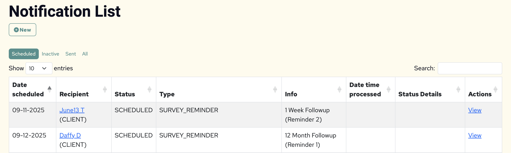

# Registering Notifications for Batch Processing

Applications need to implement some interfaces and register a handler for each Notification type they need to support. Here are the steps to take when implementing a new Notification type.

## Determine the Processing Mode

A notification type can be configured with one of two processing modes:

- IMMEDIATE: This is a notification that should be sent immediately (e.g., a client welcome email). Use the createNew method in the NotificationService to automatically trigger the batch job immediately after creation. Make sure the Notification dateScheduled is set to today or before.
- SCHEDULED: This is a notification that will be sent on the first run on or after the dateScheduled, so it can be queued for future processing.

## Create a NotificationValidator

Create a class that implements the [`NotificationValidator`](src/main/java/org/octri/notification/validator/NotificationValidator.java) interface. It should accept a Notification and return a ValidationResult. Here is an example of a simple validation for a Client Welcome Notification:

```java
public class ClientWelcomeValidator implements NotificationValidator {

	@Override
	public ValidationResult validate(Notification notification) {
		var participant = (Participant) notification.getRecipient();
		EnrollmentStatus enrollmentStatus = participant.getEnrollmentStatus();
		if (enrollmentStatus.equals(EnrollmentStatus.DECLINED) || enrollmentStatus.equals(EnrollmentStatus.WITHDRAWN)) {
			return new ValidationResult(false, "Participant enrollment status is " + enrollmentStatus);
		}
		if (participant.getEmail() == null) {
			return new ValidationResult(false, "Participant has no registered email.");
		}
		return new ValidationResult(true, null);
	}

}
```

## Create a NotificationDispatcher

Create a class that implements the [`NotificationDispatcher`](src/main/java/org/octri/notification/dispatch/NotificationDispatcher.java) interface. It should accept a Notification, send the message, and return a DispatchResult. Here is an example of a Client Welcome Dispatcher:

```java
public class ClientWelcomeDispatcher implements NotificationDispatcher {

	private final MessageDeliveryService messageDeliveryService;
	private final NotificationProperties notificationProperties;

	public ClientWelcomeDispatcher(MessageDeliveryService messageDeliveryService,
			NotificationProperties notificationProperties) {
		this.messageDeliveryService = messageDeliveryService;
		this.notificationProperties = notificationProperties;
	}

	@Override
	public DispatchResult handleDispatch(Notification notification) {
		var participant = (Participant) notification.getRecipient();
		try {
			var deliveryDetails = messageDeliveryService.sendEmail(notificationProperties.getEmail(), 
                participant.getEmail(),
				"Message Subject",
				"Message Content");
			return new DispatchResult(true, messageContent, recipient,
					deliveryDetails.isPresent() ? deliveryDetails.get() : null, null);
		} catch (UnsuccessfulDeliveryException e) {
			return new DispatchResult(false, messageContent, recipient, null, e.getErrorResponse());
		}

	}

}
```

This package provides an AbstractNotificationDispatcher that can be extended. It uses the MessageDeliveryService providing by the [Messaging Library](https://github.com/OHSU-OCTRI/messaging-lib) to deliver email and SMS messages.

## Create NotificationMetadata

Some validators and dispatchers will need additional information to process the Notification. The[`NotificationMetadata`](src/main/java/org/octri/notification/metadata/NotificationMetadata.java) interface can be used to preserve metadata in JSON format to the notificationMetadata field on the Notification. As an example, consider a notification to let a participant know that new surveys are available for completion. The application will need to know which assignment the Notification was created for (e.g., 1 Month Followup) to ensure it's still valid and dispatch appropriately. The metadata class might look like this:

```java
public class SurveyReminderMetadata extends NotificationMetadata {

	private Long assignmentId;

	public SurveyReminderMetadata() {
        // Empty constructor required for serialization/deserialization
	}

	public SurveyReminderMetadata(Long assignmentId) {
		this.assignmentId = assignmentId;
	}

	public Long getAssignmentId() {
		return assignmentId;
	}

	public void setAssignmentId(Long assignmentId) {
		this.assignmentId = assignmentId;
	}

}
```

This will be persisted to the notificationMetadata field in the database as:

```json
{"assignmentId": 1}
```

This provides the application the additional context needed. In the example below, the assignmentId is used by the validator to ensure the notification is for an assignment that is still current.

```java
public class SurveyReminderValidator implements NotificationValidator {

	private final AssignmentService assignmentService;

	public SurveyReminderValidator(AssignmentService assignmentService) {
		this.assignmentService = assignmentService;
	}

	@Override
	public ValidationResult validate(Notification notification) {
		var participant = (Participant) notification.getRecipient();
		EnrollmentStatus enrollmentStatus = participant.getEnrollmentStatus();
		if (!EnrollmentStatus.ACTIVE.equals(enrollmentStatus)) {
			return new ValidationResult(false, "Participant enrollment status is " + enrollmentStatus);
		}
		if (participant.getEmail() == null) {
			return new ValidationResult(false, "Participant has no registered email.");
		}
		SurveyReminderMetadata notificationMetadata = notification
				.getNotificationMetadata(SurveyReminderMetadata.class);
		List<ScheduledAssignment> currentAssignments = assignmentService
				.getCurrentAssignmentsByParticipant(participant);
		if (currentAssignments.stream().noneMatch(a -> a.getId().equals(notificationMetadata.getAssignmentId()))) {
			return new ValidationResult(false, "This is not a current assignment for the participant.");
		}
		return new ValidationResult(true, null);
	}
}
```

If no additional context is needed by the downstream processors., applications can use the `EmptyMetadata` implementation provided by this package.

This package also provides a convenient abstract metadata class for sending followup reminders if the recipient does not take action when first notified. Applications can extend the `AbstractReminderDayProgressionTracker` for automatic followups. When creating the initial notification in the application, provide the start date and the series of days that followups should be sent indexed from the start (e.g., 0, 4, and 7 days after the start date). When the first notification is processed by this library, the next one in the series will be created automatically if it's still valid. See the `NotificationItemWriterTest` for examples of how this works.

## Create a Viewer for Notifications

Applications can customize how Notifications appear in the list and show views provided by this package. Implement a [`NotificationViewer`](src/main/java/org/octri/notification/view/NotificationViewer.java) to format the way the Recipient and the NotificationMetadata appear in the UI. For example, this method overrides the way a recipient appears, adding a hyperlink and finding the recipient object so it can use specific fields:

```java
@Override
public String getRecipientView(Notification notification) {
    var participant = participantService.findByUuid(notification.getRecipientUuid());
    return String.format("<a href='%s/admin/participant/%s'>%s</a> (%s)", applicationLinkBuilder.getAppUrl(),
            participant.getId(), participant.getLabel(), participant.getParticipantType().getLabel());
}
```

This method overrides the way notificationMetadata is shown to the user:

```java
	@Override
	public String getMetadataView(Notification notification) {
		SurveyReminderMetadata metadata = notification.getNotificationMetadata(SurveyReminderMetadata.class);
		var assignment = assignmentService.findById(metadata.getAssignmentId());
		return String.format("%s (Reminder %s)",
				(assignment.isPresent()) ? assignment.get().getSurveyList().getName()
						: "Assignment not found",
				metadata.getCurrentIndex() + 1);
	}
```

This is how it will manifest in the Recipient and Info columns of the list page:



Because the methods `getRecipientView` and `getMetadataView` will be called for every Notification, applications may want to set up a ThreadLocal cache to optimize these queries on the full list first. In this case, applications can override the `NotificationViewer` default method `prepareCache`:

```
	/**
	 * Applications that need to fetch data for each notification can prefetch and cache in a ThreadLocal to optimize
	 * performance.
	 * 
	 * @param notifications
	 *            the list of notifications that will be viewed
	 * @return an AutoCloseable that will clear the cache when closed; default has no cache and returns a no-op
	 *         AutoCloseable
	 */
	default AutoCloseable prepareCache(Iterable<Notification> notifications) {
		return () -> {
		};
	}
```

This is how the implementation above would be rewritten to use a cache:

```
public class SurveyReminderViewer {

	private final ParticipantService participantService;
	private final ApplicationLinkBuilder applicationLinkBuilder;
	private final AssignmentService assignmentService;
	private final ThreadLocal<Map<String, Participant>> cachedParticipants = new ThreadLocal<>();
	private final ThreadLocal<Map<Long, Assignment>> cachedAssignments = new ThreadLocal<>();

	public SurveyReminderViewer(ParticipantService participantService, ApplicationLinkBuilder applicationLinkBuilder,
			AssignmentService assignmentService) {
		this.participantService = participantService;
		this.assignmentService = assignmentService;
	}

	@Override
	public AutoCloseable prepareCache(Iterable<Notification> notifications) {
		var recipientUuids = StreamSupport
				.stream(notifications.spliterator(), false)
				.map(n -> n.getRecipientUuid())
				.distinct().toList();
		var participants = StreamSupport
				.stream(participantService.findAllByUuidIn(recipientUuids).spliterator(), false)
				.collect(Collectors.toMap(Participant::getUuid, Function.identity()));
		cachedParticipants.set(participants);
		var assignmentIds = StreamSupport
				.stream(notifications.spliterator(), false)
				.map(n -> n.getNotificationMetadata(SurveyReminderMetadata.class)
						.getAssignmentId())
				.distinct().toList();
		Map<Long, Assignment> cache = StreamSupport
				.stream(assignmentService.findAllById(assignmentIds).spliterator(), false)
				.collect(Collectors.toMap(Assignment::getId, Function.identity()));
		cachedAssignments.set(cache);

		return () -> {
			cachedParticipants.remove();
			cachedAssignments.remove();
		};
	}

	@Override
	public String getRecipientView(Notification notification) {
		var cache = cachedParticipants.get();
		var participant = cache.get(notification.getRecipientUuid());
		return participant != null
				? String.format("<a href='%s/admin/participant/%s'>%s</a> (%s)", applicationLinkBuilder.getAppUrl(),
						participant.getId(), participant.getLabel(), participant.getParticipantType().getLabel())
				: "Participant not found";
	}

	@Override
	public String getMetadataView(Notification notification) {
		SurveyReminderMetadata metadata = notification.getNotificationMetadata(SurveyReminderMetadata.class);
		Map<Long, Assignment> cache = cachedAssignments.get();
		var assignment = cache.get(metadata.getAssignmentId());
		return String.format("%s (Reminder %s)",
				(assignment != null) ? assignment.getSurveyList().getName()
						: "Assignment not found",
				metadata.getCurrentIndex() + 1);
	}

}
```

## Register the Notification Type

With all the necessary classes defined, use the [`NotificationTypeRegistry`](src/main/java/org/octri/notification/registry/NotificationTypeRegistry.java) to handle the new custom type.

```java
@Component
public class NotificationRegistration {

	public static final String CLIENT_WELCOME = "CLIENT_WELCOME";

	private final NotificationProperties notificationProperties;
	private final NotificationTypeRegistry notificationTypeRegistry;
	private final MessageDeliveryService messageDeliveryService;
	private final ParticipantService participantService;

	public NotificationRegistration(NotificationProperties notificationProperties,
			NotificationTypeRegistry notificationTypeRegistry, MessageDeliveryService messageDeliveryService,
			ParticipantService participantService) {
		this.notificationProperties = notificationProperties;
		this.notificationTypeRegistry = notificationTypeRegistry;
		this.messageDeliveryService = messageDeliveryService;
		this.participantService = participantService;
	}

	@PostConstruct
	public void registerNotificationTypes() {
		notificationTypeRegistry.register(NotificationRegistration.CLIENT_WELCOME, ProcessingMode.IMMEDIATE,
				EmptyMetadata.class,
				new ClientWelcomeValidator(),
				new ClientWelcomeDispatcher(messageDeliveryService, notificationProperties),
				new ClientWelcomeNotificationViewer(participantService));
	}
}
```
